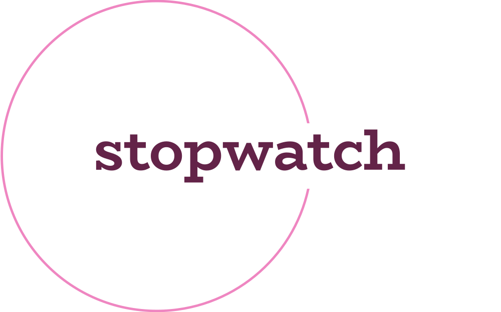
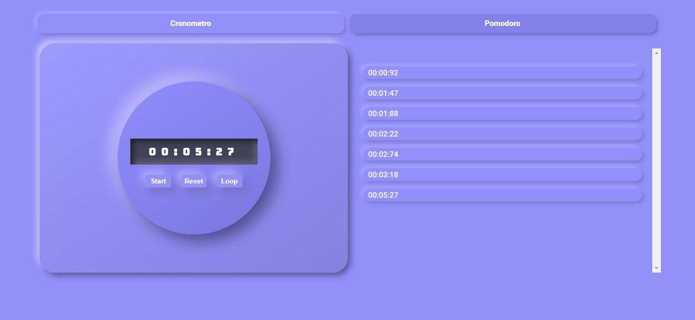
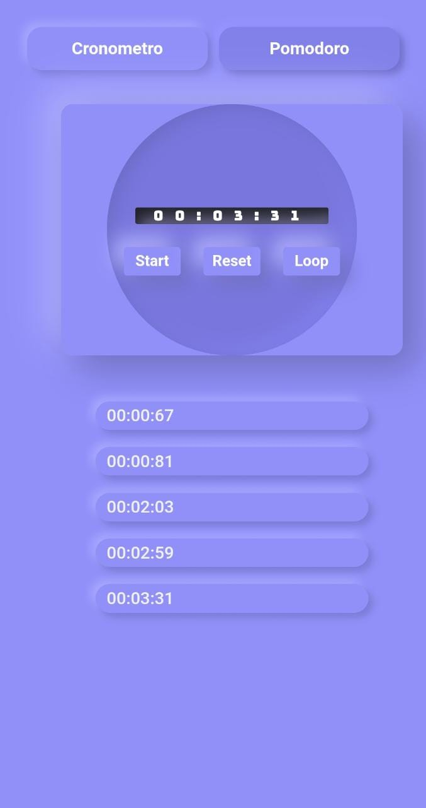
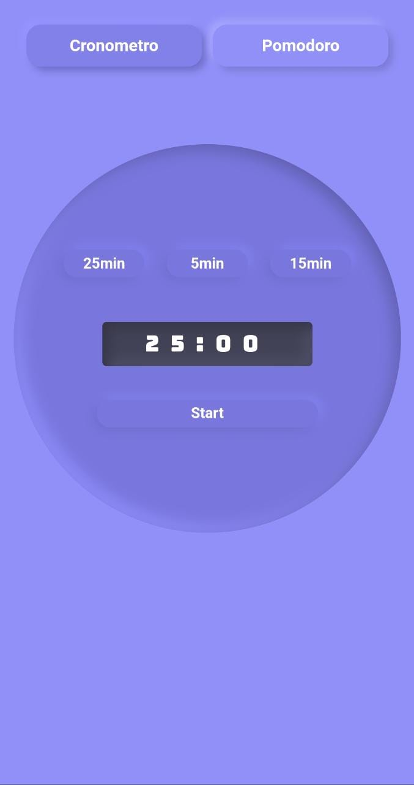

<h1>
  <a href="stopwatch-pomodoro.web.app/">Stopwatch</a>
</h1>
<p>This application contains a Tab component that has two tabs, one for a stopwatch and one for a Pomodoro Timer.</p>
<br/>
<p>click <a href="stopwatch-pomodoro.web.app/">here</a> to see the live code</p>

<div style="display: flex">

</div>

## Preview
<hr/>
<br/>

### Desktop
<div style="display: flex; justify-content: flex-start; gap: 10px; margin-top: 15px; margin-bottom: 35px">


</div>

### Mobile
<div style="display: flex; justify-content: flex-start; gap: 10px;">


</div>

<br/>

## Core Technologies
<div style="display: inline_block">
  
  
  
  
</div>
<br/>


<h2 id="clone">Clone</h2>

<h4>Starting</h4>

```
git clone https://github.com/BVictorsk/stopwatch.git
npm install
```


<h2 id="contribute">Contribute 🚀</h2>

If you want to contribute, clone this repo, create your work branch and get your hands dirty!

```bash
git clone https://github.com/BVictorsk/stopwatch.git
git checkout -b feature/NAME
```

 At the end, open a Pull Request explaining the problem solved or feature made, if exists, append screenshot of visual modifications and wait for the review!

[How to create a Pull Request](https://www.atlassian.com/br/git/tutorials/making-a-pull-request)

[Commit pattern](https://gist.github.com/joshbuchea/6f47e86d2510bce28f8e7f42ae84c716)


<h2 id="license">License 📃 </h2>

This project is under MIT license